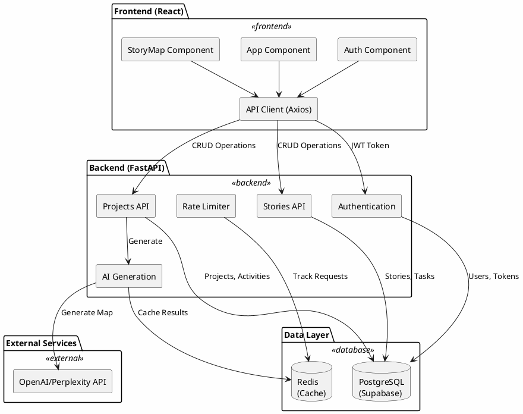
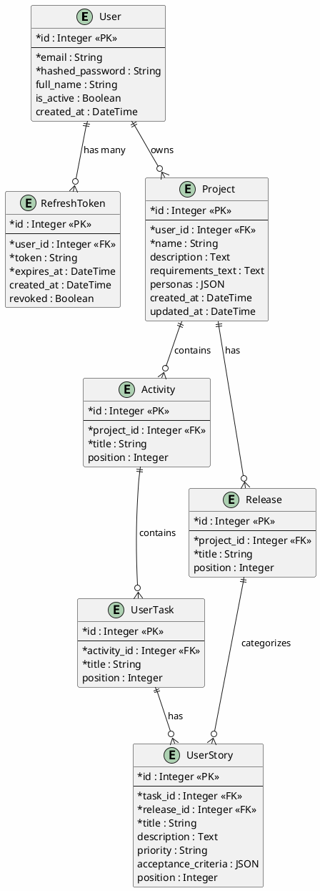
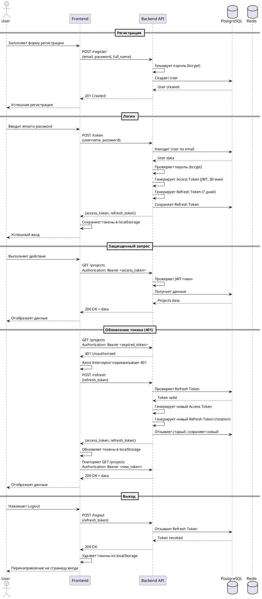
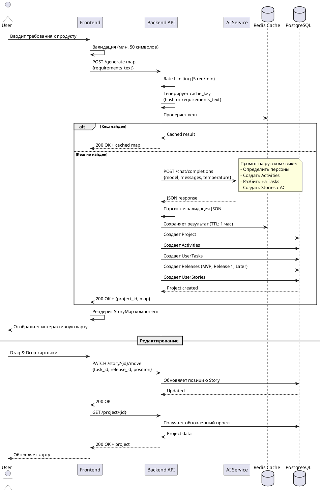
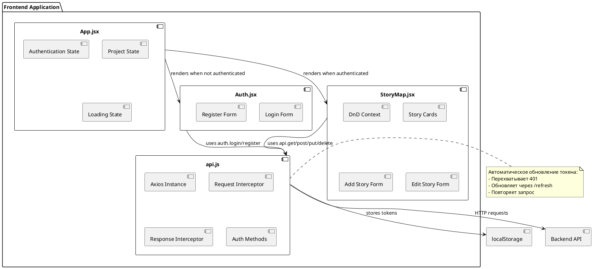
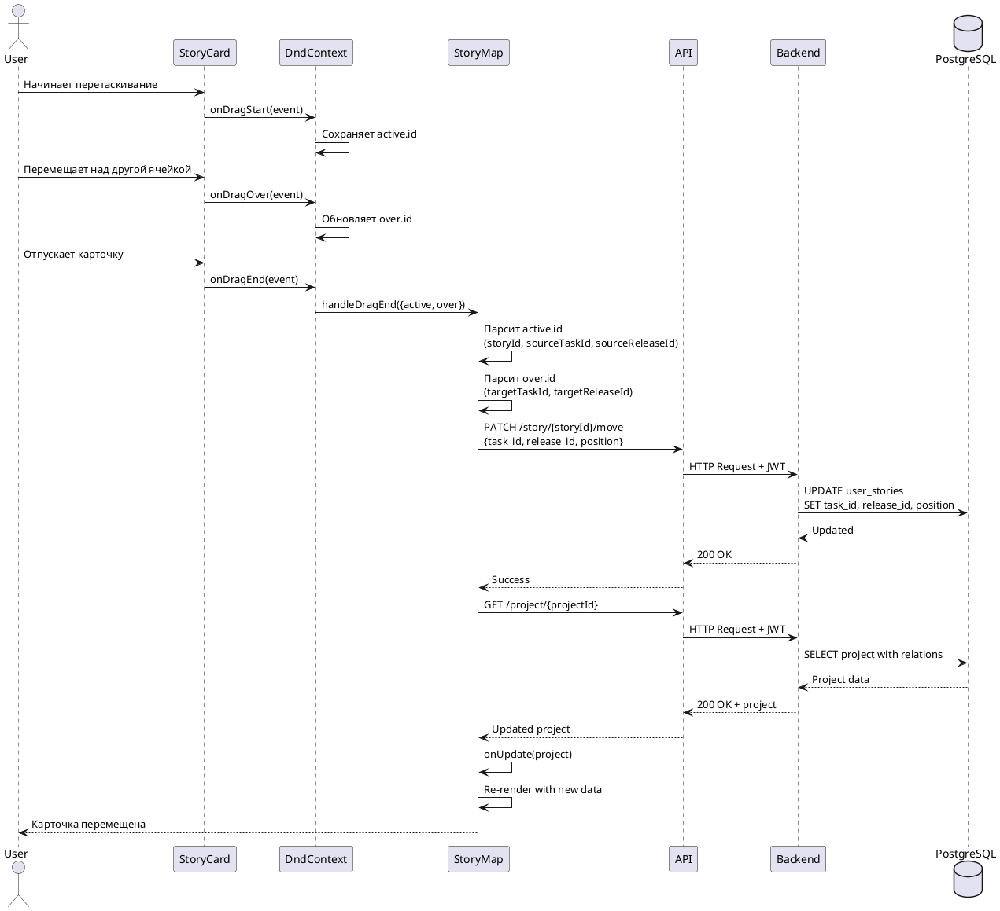
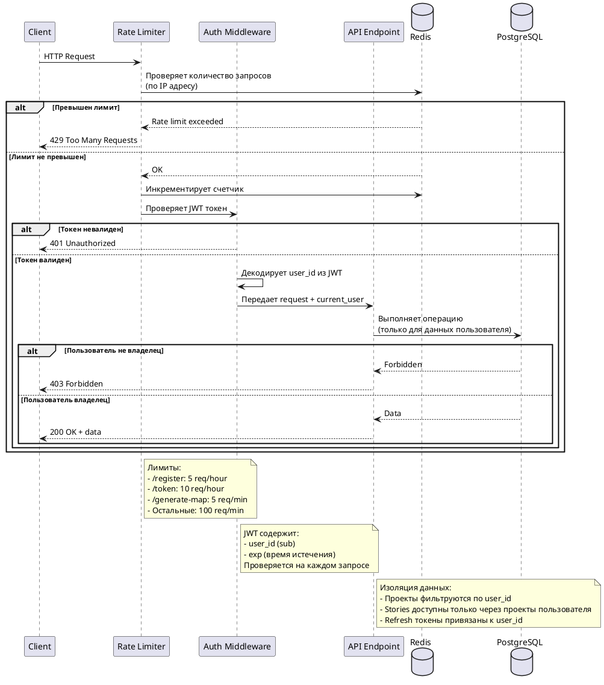
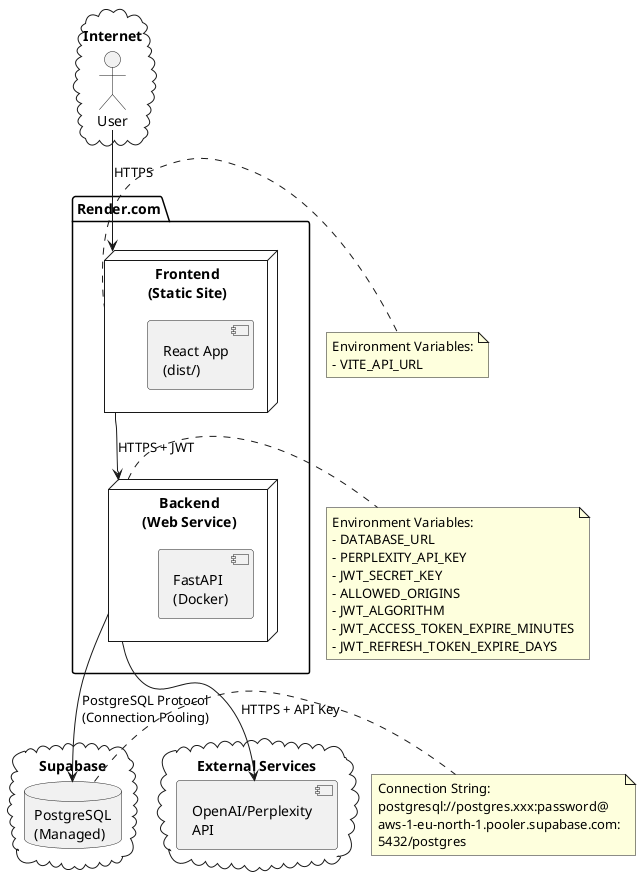
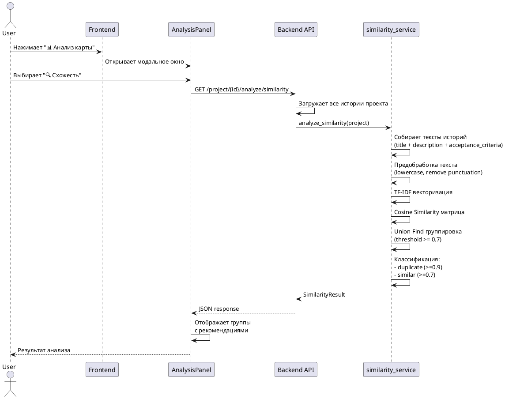
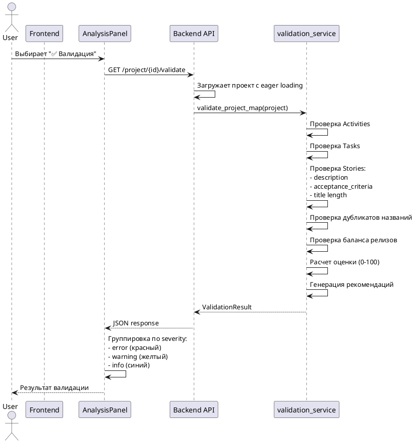

# Архитектура AI User Story Mapper

## Обзор системы

AI User Story Mapper — это веб-приложение для автоматической генерации карт пользовательских историй (User Story Maps) на основе текстовых требований с использованием AI.

## Технологический стек

### Backend (v2.0.0 - Модульная архитектура)

**Структура:**
```
backend/
├── main.py              # FastAPI app (90 строк)
├── config.py            # Конфигурация с валидацией
├── dependencies.py      # FastAPI dependencies
├── models/              # SQLAlchemy ORM модели
├── schemas/             # Pydantic валидация API
├── services/            # Бизнес-логика (Service Layer)
├── api/                 # API роуты (Endpoint handlers)
└── utils/               # Утилиты (database setup)
```

**Технологии:**
- **FastAPI** — веб-фреймворк
- **SQLAlchemy** — ORM для работы с БД
- **PostgreSQL** — база данных (production)
- **Alembic** — миграции БД
- **OpenAI/Perplexity API** — генерация карты через AI
- **Redis** — кеширование AI ответов
- **JWT** — аутентификация
- **Slowapi** — rate limiting

**Архитектурные принципы:**
- **Clean Architecture** - разделение на слои
- **Service Layer Pattern** - переиспользуемая бизнес-логика
- **Dependency Injection** - FastAPI dependencies
- **SOLID** - Single Responsibility Principle

### Frontend
- **React** — UI библиотека
- **Vite** — сборщик
- **Tailwind CSS** — стилизация
- **Axios** — HTTP клиент
- **@dnd-kit** — drag-and-drop функциональность

---

## Backend Модульная архитектура (v2.0.0)

### Разделение на слои (Clean Architecture)

```
┌─────────────────────────────────────────────────────────┐
│                   API Layer (api/)                      │
│  ┌───────────┬──────────────┬──────────────┬─────────┐ │
│  │ auth.py   │ projects.py  │ stories.py   │health.py│ │
│  └─────┬─────┴──────┬───────┴──────┬───────┴────┬────┘ │
└────────┼────────────┼──────────────┼────────────┼──────┘
         │            │              │            │
         ↓            ↓              ↓            ↓
┌─────────────────────────────────────────────────────────┐
│              Service Layer (services/)                  │
│  ┌──────────────────────┬──────────────────────────┐   │
│  │  auth_service.py     │   ai_service.py          │   │
│  │  - authenticate_user │   - generate_ai_map      │   │
│  │  - create_tokens     │   - cache_results        │   │
│  │  - verify_password   │   - parse_ai_response    │   │
│  ├──────────────────────┼──────────────────────────┤   │
│  │  similarity_service  │   validation_service     │   │
│  │  - analyze_similarity│   - validate_project_map │   │
│  │  - TF-IDF vectors    │   - calculate_score      │   │
│  │  - find_duplicates   │   - get_recommendations  │   │
│  └──────────┬───────────┴──────────┬───────────────┘   │
└─────────────┼──────────────────────┼───────────────────┘
              │                      │
              ↓                      ↓
┌─────────────────────────────────────────────────────────┐
│              Data Layer (models/ + schemas/)            │
│  ┌──────────────┬───────────────┬──────────────┐       │
│  │ models/      │ schemas/      │ utils/       │       │
│  │ - user.py    │ - user.py     │ - database.py│       │
│  │ - project.py │ - project.py  │              │       │
│  │ - story.py   │ - story.py    │              │       │
│  └──────────────┴───────────────┴──────────────┘       │
└─────────────────────────────────────────────────────────┘
```

### Файловая структура backend/

```
backend/
├── main.py                    # 90 строк - FastAPI app setup
│   └── Подключает роуты из api/
│
├── config.py                  # Конфигурация с валидацией
│   ├── Загрузка ENV переменных
│   ├── Валидация JWT_SECRET_KEY
│   └── Автоопределение AI провайдера
│
├── dependencies.py            # Переиспользуемые dependencies
│   ├── get_current_user()
│   ├── get_current_active_user()
│   └── OAuth2 scheme
│
├── models/                    # SQLAlchemy ORM модели
│   ├── user.py               # User, RefreshToken
│   ├── project.py            # Project, Activity, UserTask, Release
│   └── story.py              # UserStory + композитные индексы
│
├── schemas/                   # Pydantic схемы (API validation)
│   ├── user.py               # UserCreate, UserResponse, Token
│   ├── project.py            # ProjectResponse, RequirementsInput
│   ├── story.py              # StoryCreate, StoryUpdate, StoryMove
│   └── analysis.py           # ValidationResult, SimilarityResult (v2.3.0)
│
├── services/                  # Бизнес-логика (Service Layer)
│   ├── auth_service.py       # JWT, password hashing, authentication
│   │   ├── verify_password()
│   │   ├── create_access_token()
│   │   ├── create_refresh_token()
│   │   └── authenticate_user()
│   │
│   ├── ai_service.py         # AI генерация карт
│   │   ├── generate_ai_map()
│   │   ├── enhance_requirements()
│   │   ├── get_cache_key()
│   │   └── OpenAI/Perplexity клиент
│   │
│   ├── similarity_service.py # Анализ схожести историй (v2.3.0)
│   │   ├── analyze_similarity()
│   │   ├── calculate_similarity_tfidf()
│   │   ├── find_similar_groups()
│   │   └── get_similarity_summary()
│   │
│   └── validation_service.py # Валидация структуры карты (v2.3.0)
│       ├── validate_project_map()
│       ├── calculate_validation_score()
│       └── get_validation_summary()
│
├── api/                       # API роуты (Endpoint handlers)
│   ├── auth.py               # POST /register, /token, /refresh, /logout
│   │                         # GET /me
│   │
│   ├── projects.py           # POST /generate-map, /enhance-requirements
│   │                         # GET /project/{id}, /projects
│   │
│   ├── stories.py            # POST /story, /story/{id}/ai-improve
│   │                         # PUT /story/{id}
│   │                         # DELETE /story/{id}
│   │                         # PATCH /story/{id}/move
│   │
│   ├── analysis.py           # GET /project/{id}/validate (v2.3.0)
│   │                         # GET /project/{id}/analyze/similarity
│   │                         # POST /project/{id}/analyze/full
│   │
│   └── health.py             # GET /health, /ready
│
└── utils/
    └── database.py           # Database setup, SessionLocal, get_db
```

### Поток запроса (Request Flow)

```
1. HTTP Request → main.py (FastAPI app)
   ↓
2. Middleware (CORS, Rate Limiting)
   ↓
3. api/{module}.py (роутер обрабатывает endpoint)
   ↓
4. dependencies.py (проверка авторизации)
   ↓
5. services/{module}_service.py (бизнес-логика)
   ↓
6. models/{module}.py (работа с БД через SQLAlchemy)
   ↓
7. schemas/{module}.py (валидация и сериализация ответа)
   ↓
8. HTTP Response
```

### Преимущества модульной архитектуры

#### 1. Separation of Concerns
- **Models** - только структура данных (SQLAlchemy)
- **Schemas** - только валидация API (Pydantic)
- **Services** - только бизнес-логика
- **API** - только обработка HTTP запросов

#### 2. Переиспользование кода
```python
# Сервис можно использовать из любого endpoint
from services.auth_service import authenticate_user

# В auth.py
user = authenticate_user(db, email, password)

# В другом endpoint тоже можно использовать
user = authenticate_user(db, form_data.username, form_data.password)
```

#### 3. Легкое тестирование
```python
# Можно тестировать сервис независимо от API
def test_authenticate_user():
    user = authenticate_user(test_db, "test@example.com", "password")
    assert user is not None
```

#### 4. Масштабируемость
Добавление новой функциональности:
1. Создать модель в `models/my_feature.py`
2. Создать схему в `schemas/my_feature.py`
3. Создать сервис в `services/my_feature_service.py`
4. Создать роуты в `api/my_feature.py`
5. Подключить роутер в `main.py`

---

## Общая архитектура системы



---

## Модель данных



---

## Поток аутентификации



---

## Поток генерации User Story Map



---

## Компонентная архитектура Frontend



---

## Последовательность Drag & Drop



---

## Rate Limiting и Безопасность



---

## Deployment Architecture (Render + Supabase)



---

## Ключевые архитектурные решения

### 1. Аутентификация
- **JWT** для stateless аутентификации
- **Refresh Tokens** для продления сессии без повторного логина
- **Token Rotation** для повышения безопасности
- **Axios Interceptors** для автоматического обновления токенов

### 2. Изоляция данных
- Все проекты привязаны к `user_id`
- Фильтрация на уровне SQL запросов
- Проверка владельца перед операциями

### 3. Rate Limiting
- Защита от DDoS и злоупотреблений
- Разные лимиты для разных эндпоинтов
- Хранение счетчиков в Redis (если доступен)

### 4. Кеширование
- Redis для кеширования AI ответов (TTL: 1 час)
- Уменьшение нагрузки на AI API
- Экономия на API запросах

### 5. Миграции БД
- Alembic для версионирования схемы
- Автоматический запуск миграций при деплое
- Поддержка rollback

### 6. Обработка ошибок
- Централизованная обработка на frontend (api.js)
- Детальные сообщения об ошибках
- Логирование через Sentry (опционально)

### 7. Производительность
- Connection Pooling для PostgreSQL
- Lazy loading для больших проектов
- Оптимизация SQL запросов (joinedload)
- **Композитные индексы** (v2.0.0):
  - `idx_activity_project_position` - быстрая сортировка активностей
  - `idx_task_activity_position` - быстрая сортировка задач
  - `idx_story_task_release` - быстрый поиск историй по ячейке
  - `idx_story_position` - оптимизация drag & drop операций

---

## Безопасность

### Реализованные меры:
1. **CORS** — ограничение доменов через `ALLOWED_ORIGINS`
2. **Rate Limiting** — защита от брутфорса и DDoS
3. **JWT** — безопасная аутентификация
4. **Password Hashing** — bcrypt для хранения паролей
5. **SQL Injection Protection** — SQLAlchemy ORM
6. **XSS Protection** — React автоматически экранирует
7. **HTTPS** — обязательно в production (Render)

### Рекомендации для production:
- Использовать сильный `JWT_SECRET_KEY` (минимум 32 символа)
- Настроить `ALLOWED_ORIGINS` на конкретные домены
- Включить Sentry для мониторинга ошибок
- Регулярно обновлять зависимости
- Настроить backup базы данных

---

## Масштабирование

### Текущая архитектура поддерживает:
- Горизонтальное масштабирование backend (stateless)
- Вертикальное масштабирование БД (Supabase)
- CDN для frontend (Render)

### Для дальнейшего масштабирования:
- Load Balancer перед backend
- Read Replicas для PostgreSQL
- Distributed Redis Cluster
- Message Queue для асинхронных задач
- Microservices для AI генерации

---

## Мониторинг и логирование

### Текущая реализация:
- Python logging (INFO level)
- Sentry для error tracking (опционально)
- Render встроенные логи

### Рекомендации:
- Prometheus + Grafana для метрик
- ELK Stack для централизованного логирования
- Uptime monitoring (Pingdom, UptimeRobot)
- Performance monitoring (New Relic, DataDog)

---

## Анализ схожести и валидация (v2.3.0)

### Поток анализа схожести



### Поток валидации карты



### Алгоритм TF-IDF + Cosine Similarity

```
1. Preprocessing:
   - Приведение к нижнему регистру
   - Удаление пунктуации
   - Токенизация
   - Удаление стоп-слов (русские + специфичные для User Stories)

2. TF-IDF Vectorization:
   - Term Frequency: TF(t,d) = count(t in d) / total_words(d)
   - Inverse Document Frequency: IDF(t) = log(N / df(t))
   - TF-IDF(t,d) = TF(t,d) × IDF(t)

3. Cosine Similarity:
   - similarity(A,B) = (A · B) / (||A|| × ||B||)
   - Результат: матрица NxN со значениями 0.0 - 1.0

4. Grouping (Union-Find):
   - Для каждой пары с similarity >= threshold: union(i, j)
   - Группировка компонент связности
   - Классификация: duplicate (>=0.9) или similar (>=0.7)
```

### Формула расчета качества карты

```
score = 100 - penalties + bonuses

Penalties:
- ERROR: -20 баллов (критические проблемы)
- WARNING: -5 баллов (предупреждения)
- INFO: -1 балл (информация)
- Duplicate in similarity: -10 баллов (макс. -30)

Bonuses:
- % историй с описанием × 5 (макс. +5)
- % историй с AC × 5 (макс. +5)

score = max(0, min(100, score))
```
