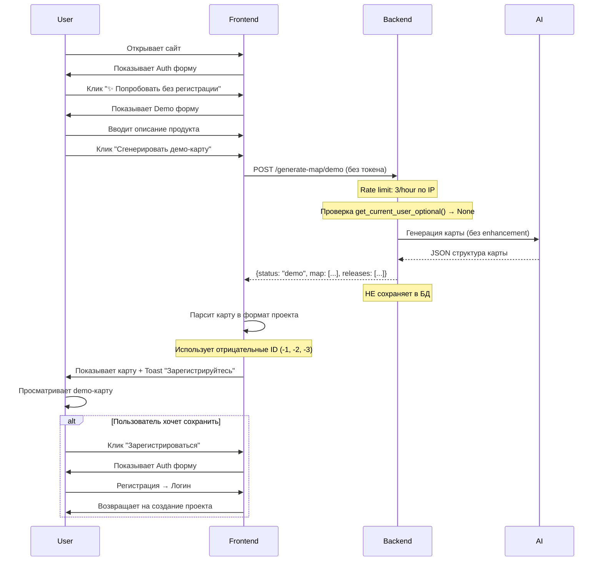

# Фаза 0: Demo-режим без регистрации

**Статус:** ✅ Реализовано
**Дата:** Декабрь 2025
**Цель:** Убрать барьер входа, показать ценность продукта мгновенно

## Обзор

Фаза 0 включает три ключевые фичи для снижения барьера входа:

1. **Demo без регистрации** — генерация карты без email (3 запроса/час)
2. **Кликабельный пример** — мгновенный просмотр готовой карты Hybe Assist
3. **Контекстный прогресс** — детальные этапы вместо простого спиннера

### Ключевые метрики
- **Bounce rate:** Цель <60% (было ~80%)
- **Rate limit:** 3 запроса/час с IP для demo
- **Время до первой карты:** <40 сек (demo) | <1 сек (пример)
- **Конверсия в регистрацию:** Целевая >15%

### Реализованные фичи

| Фича | Статус | Описание |
|------|--------|----------|
| Demo без регистрации | ✅ | POST /generate-map/demo, rate limit 3/hour |
| Кликабельный пример | ✅ | Загрузка из JSON за <1 сек |
| Контекстный прогресс | ✅ | "Анализирую роли...", "Генерирую задачи..." |

---

## Архитектура

### Диаграмма последовательности



---

## Backend

### 1. Опциональная аутентификация

**Файл:** `backend/dependencies.py`

Добавлена новая dependency для анонимных запросов:

```python
def get_current_user_optional(
    request: Request,
    db: Session = Depends(get_db)
) -> User | None:
    """
    Опциональная dependency для получения пользователя.
    Возвращает None если токен отсутствует или невалиден.
    Используется для demo-режима без регистрации.
    """
    try:
        token = _extract_token(request)
        user_id = decode_access_token(token)
        user = db.query(User).filter(User.id == user_id).first()
        return user if user and user.is_active else None
    except:
        # Токен не найден или невалиден - разрешаем анонимный доступ
        return None
```

**Отличия от `get_current_active_user()`:**
- ❌ Не выбрасывает HTTPException при отсутствии токена
- ✅ Возвращает `None` для анонимных запросов
- ✅ Безопасно для публичных endpoint'ов

### 2. Demo endpoint

**Файл:** `backend/api/projects.py`

```python
@router.post("/generate-map/demo")
@limiter.limit("3/hour")
def generate_map_demo(
    req: RequirementsInput,
    request: Request,
    current_user: User | None = Depends(get_current_user_optional),
    db: Session = Depends(get_db)
):
    """
    Demo-режим: генерация карты БЕЗ регистрации (один раз).

    Отличия от обычного /generate-map:
    - Не требует аутентификации (current_user может быть None)
    - Строгий rate limit: 3 запроса в час с IP
    - Возвращает карту напрямую (не сохраняет в БД)
    - Нет возможности редактировать результат
    """
```

**Особенности:**

| Параметр | Обычный режим | Demo режим |
|----------|---------------|------------|
| Аутентификация | ✅ Обязательна | ❌ Опциональна |
| Rate limit | 10/hour | **3/hour** (строже!) |
| Enhancement | ✅ Да (Stage 1) | ❌ Нет (экономим время) |
| Сохранение в БД | ✅ Да | ❌ Нет |
| Редактирование | ✅ Да | ❌ Нет |
| Project ID | Реальный (1, 2, 3...) | Фейковый (-1) |

**Возвращаемая структура:**

```json
{
  "status": "demo",
  "project_name": "Demo Project",
  "map": [
    {
      "activity": "...",
      "tasks": [
        {
          "taskTitle": "...",
          "stories": [
            {
              "title": "...",
              "description": "...",
              "priority": "MVP",
              "acceptanceCriteria": [...]
            }
          ]
        }
      ]
    }
  ],
  "releases": [
    {"id": -1, "title": "MVP", "position": 0},
    {"id": -2, "title": "Release 1", "position": 1},
    {"id": -3, "title": "Later", "position": 2}
  ],
  "demo_mode": true,
  "message": "Это демо-карта. Зарегистрируйтесь чтобы сохранить и редактировать проект."
}
```

---

## Frontend

### 1. API клиент

**Файл:** `frontend/src/api.ts`

```typescript
export const enhancement = {
  // ... существующие методы

  generateMapDemo: (text: string) =>
    axios.post<{
      status: string;
      project_name: string;
      map: any[];
      releases: any[];
      demo_mode: boolean;
      message: string;
    }>(`${API_URL}/generate-map/demo`, {
      text,
      skip_enhancement: true,
      use_enhanced_text: false,
      use_agent: false,
    }),
};
```

**Почему используем `axios` напрямую, а не `api` instance?**
- `api` instance добавляет Authorization header из interceptor
- Для demo не нужен токен → используем чистый axios

### 2. Auth компонент

**Файл:** `frontend/src/Auth.jsx`

Добавлена кнопка "Попробовать без регистрации":

```jsx
{onTryDemo && (
  <div className="mt-6 pt-6 border-t border-gray-200">
    <button
      onClick={onTryDemo}
      className="w-full bg-gradient-to-r from-purple-600 to-blue-600 text-white py-3 rounded-lg font-semibold hover:from-purple-700 hover:to-blue-700 transition shadow-md"
    >
      ✨ Попробовать без регистрации
    </button>
    <p className="text-xs text-gray-500 mt-2 text-center">
      Сгенерируйте одну карту бесплатно без создания аккаунта
    </p>
  </div>
)}
```

**Дизайн:**
- 🎨 Gradient purple→blue (отличается от обычных синих кнопок)
- ✨ Emoji для привлечения внимания
- 📝 Подпись объясняет что это

### 3. App логика

**Файл:** `frontend/src/App.jsx`

**Новые состояния:**
```javascript
const [view, setView] = useState('list'); // + 'demo'
const [demoMode, setDemoMode] = useState(false);
```

**Функция генерации:**
```javascript
const handleDemoGenerate = async () => {
  // 1. Валидация
  // 2. Вызов API
  const res = await enhancement.generateMapDemo(input);

  // 3. Парсинг в формат проекта
  const demoProject = {
    id: -1, // фейковый ID
    name: res.data.project_name,
    activities: [],
    releases: res.data.releases,
    demo_mode: true,
  };

  // 4. Преобразование map[] в activities/tasks/stories
  res.data.map.forEach((activityItem, actIdx) => {
    // ... парсинг структуры с отрицательными ID
  });

  // 5. Показ карты
  setProject(demoProject);
  toast.success(res.data.message);
};
```

**Отрицательные ID для demo:**
- Activity ID: `-1, -2, -3...`
- Task ID: `-(actIdx * 100 + taskIdx)`
- Story ID: `-(actIdx * 10000 + taskIdx * 100 + storyIdx)`
- Release ID: `-1 (MVP), -2 (Release 1), -3 (Later)`

Это позволяет отличить demo-элементы от реальных в БД.

---

## UX Flow

### Путь пользователя (Happy Path)

```
┌─────────────────────────────────────┐
│  Пользователь заходит на сайт       │
└──────────────┬──────────────────────┘
               │
               ▼
┌─────────────────────────────────────┐
│  Auth форма                         │
│  ┌───────────────────────────────┐  │
│  │ Email: ___________________    │  │
│  │ Password: ________________    │  │
│  │ [Войти] [Регистрация]         │  │
│  │ ─────────────────────────────  │  │
│  │ ✨ Попробовать без регистрации│  │ ← Главный CTA
│  └───────────────────────────────┘  │
└──────────────┬──────────────────────┘
               │ Клик
               ▼
┌─────────────────────────────────────┐
│  Demo форма                         │
│  ┌───────────────────────────────┐  │
│  │ ✨ Демо-режим                 │  │
│  │ Опишите продукт:              │  │
│  │ ┌───────────────────────────┐ │  │
│  │ │Приложение для доставки... │ │  │
│  │ └───────────────────────────┘ │  │
│  │ [Сгенерировать демо-карту]    │  │
│  └───────────────────────────────┘  │
└──────────────┬──────────────────────┘
               │ 30-40 сек
               ▼
┌─────────────────────────────────────┐
│  User Story Map (demo)              │
│  ┌───────────────────────────────┐  │
│  │ 🎉 Демо-карта сгенерирована!  │  │
│  │ Зарегистрируйтесь для сохранения│
│  └───────────────────────────────┘  │
│  ┌────┬────┬────┐                   │
│  │Act1│Act2│Act3│                   │
│  ├────┼────┼────┤                   │
│  │Tsk1│Tsk2│Tsk3│                   │
│  ├────┼────┼────┤                   │
│  │Str1│Str2│Str3│                   │
│  └────┴────┴────┘                   │
└──────────────┬──────────────────────┘
               │
         ┌─────┴─────┐
         │           │
         ▼           ▼
   [Зарегистрироваться]  [Просмотр]
         │
         ▼
   Сохранение проекта
```

### Альтернативные сценарии

**Сценарий 1: Rate limit превышен**
```
User → Demo форма → API → 429 Too Many Requests
Frontend: "Вы превысили лимит демо-генераций (3/час). Зарегистрируйтесь для безлимитного доступа!"
```

**Сценарий 2: AI ошибка**
```
User → Demo форма → API → AI failure → 500 Error
Frontend: "Ошибка генерации. Попробуйте упростить описание или зарегистрируйтесь для расширенных возможностей."
```

---

## Безопасность

### Rate Limiting

**Уровень 1: IP-based (Slowapi)**
```python
@limiter.limit("3/hour")  # 3 запроса в час с одного IP
```

**Зачем так строго?**
- Защита от злоупотреблений API
- Экономия AI токенов (каждый запрос ~ 2000 токенов)
- Мотивация к регистрации

**Уровень 2: Валидация входных данных**
```python
if not req.text or not req.text.strip():
    raise HTTPException(status_code=400, detail="Requirements text cannot be empty")
```

### Что НЕ сохраняется в demo

- ❌ Project в БД
- ❌ Activities, Tasks, Stories
- ❌ История изменений
- ❌ Metadata пользователя
- ✅ Redis cache AI ответа (для экономии при повторных запросах)

---

## Мониторинг и метрики

### Логирование

```python
logger.info(f"Demo mode: Generating map without enhancement (IP: {request.client.host})")
logger.info(f"Demo map generated successfully (IP: {request.client.host})")
```

### Ключевые метрики для отслеживания

1. **Bounce rate** (цель <60%)
   - До demo: ~80%
   - После demo: отслеживать через Google Analytics

2. **Demo→Registration conversion** (цель >15%)
   - Количество demo-генераций
   - Количество регистраций после demo

3. **Rate limit hits**
   - Сколько раз срабатывает лимит 3/hour
   - Если много → возможно нужно повысить до 5/hour

4. **AI costs**
   - Стоимость demo-генераций
   - ROI: Demo cost vs Registration value

---

## Ограничения demo-режима

### Что доступно
- ✅ Генерация карты
- ✅ Просмотр всех элементов
- ✅ Визуализация релизов

### Что НЕ доступно
- ❌ Редактирование историй
- ❌ Drag & Drop
- ❌ Добавление новых элементов
- ❌ Сохранение изменений
- ❌ AI Assistant для улучшения
- ❌ Анализ дубликатов
- ❌ Экспорт карты

Эти ограничения мотивируют к регистрации.

---

## Дальнейшие улучшения (Backlog)

### P0 (Критично)
- [ ] Добавить баннер "Зарегистрируйтесь" над demo-картой
- [ ] Заблокировать редактирование в demo-режиме
- [ ] Добавить кнопку "Сохранить → Регистрация"

### P1 (Важно)
- [ ] Аналитика: track demo usage в Google Analytics
- [ ] A/B тест: 3 vs 5 demo-генераций в час
- [ ] Сохранение demo-карты в localStorage для восстановления после регистрации

### P2 (Желательно)
- [ ] Pre-filled примеры ("E-commerce", "SaaS", "Mobile app")
- [ ] Прогресс-бар с этапами ("Анализирую роли...", "Генерирую задачи...")
- [ ] Видео-туториал на demo-странице

---

## Тестирование

### Ручное тестирование

**Сценарий 1: Успешная генерация**
1. Открыть сайт без логина
2. Нажать "✨ Попробовать без регистрации"
3. Ввести описание (минимум 10 символов)
4. Нажать "Сгенерировать демо-карту"
5. ✅ Ожидаемо: карта появляется через 30-40 сек
6. ✅ Ожидаемо: Toast "Зарегистрируйтесь для сохранения"

**Сценарий 2: Rate limit**
1. Сгенерировать 3 demo-карты подряд
2. Попробовать 4-ую
3. ✅ Ожидаемо: HTTP 429 "Rate limit exceeded"

**Сценарий 3: Регистрация после demo**
1. Сгенерировать demo-карту
2. Нажать "Зарегистрироваться"
3. Пройти регистрацию
4. ✅ Ожидаемо: Возврат на create форму

### Автоматизированное тестирование

```python
# backend/test_demo_mode.py
def test_demo_generation_without_auth():
    response = client.post("/generate-map/demo", json={
        "text": "Test product description"
    })
    assert response.status_code == 200
    assert response.json()["demo_mode"] == True
    assert response.json()["status"] == "demo"

def test_demo_rate_limit():
    for i in range(4):
        response = client.post("/generate-map/demo", json={
            "text": f"Test {i}"
        })
        if i < 3:
            assert response.status_code == 200
        else:
            assert response.status_code == 429
```

---

## Развертывание

### Checklist перед деплоем

- [ ] ✅ Backend: проверить синтаксис Python
- [ ] ✅ Frontend: проверить TypeScript компиляцию
- [ ] ⚠️ Redis: убедиться что доступен (для кеширования)
- [ ] ⚠️ AI API keys: проверить лимиты (Gemini/Groq/OpenAI)
- [ ] 📊 Мониторинг: добавить логи в Sentry/LogRocket

### Environment variables

Нет новых переменных окружения. Используются существующие:
- `GEMINI_API_KEY` / `GROQ_API_KEY` / `OPENAI_API_KEY`
- `REDIS_URL` (опционально)

---

## Заключение

Demo-режим — **критический фактор** для снижения bounce rate и увеличения конверсии.

**Ключевые преимущества:**
- ⚡ Мгновенная ценность (без регистрации)
- 🎯 Низкий барьер входа
- 💰 Контролируемые расходы (3/hour limit)
- 🔒 Безопасность (не сохраняем в БД)

**Следующие шаги:**
1. ✅ Demo-режим реализован
2. 🔜 Добавить баннер в demo-карте
3. 🔜 Кликабельные примеры на главной
4. 🔜 Контекстный прогресс-бар

**Целевые метрики через месяц:**
- Bounce rate: <60% (было 80%)
- Demo→Registration: >15%
- Demo usage: >100/месяц
